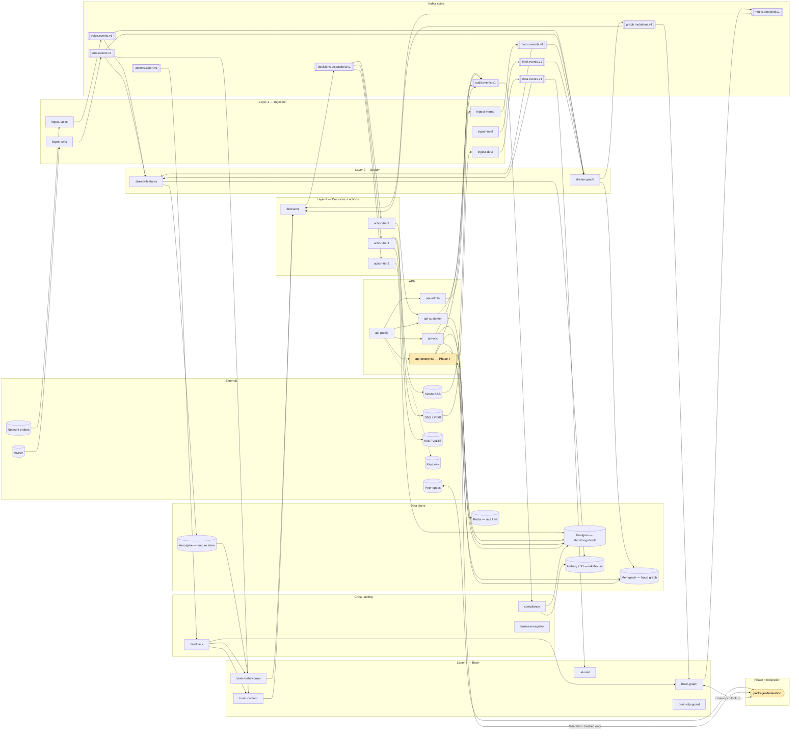

# C4 Level 2 — Containers

Every deployable service in `services/` plus the data plane it talks to.
Phase 1–3 services and the Phase 4 additions (federation, group portal).

**What to look for.** Five layers, one Kafka spine, four data stores.
The Phase 4 additions are highlighted: `api-enterprise` (the B2B portal)
and `packages/federation` (the cross-opco protocol). Notice that the
federation package is the *only* path to peer opcos — every cross-opco
flow goes through it, which is where PII redaction is enforced.
