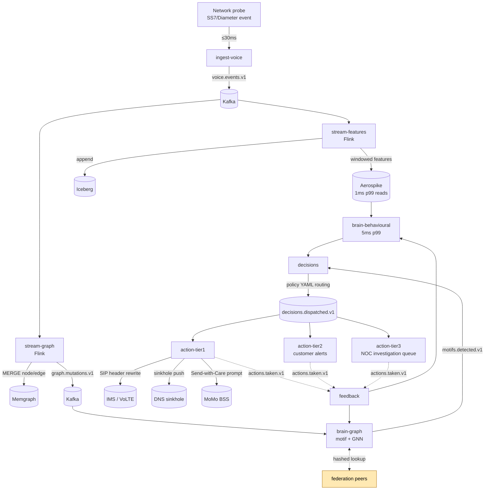

# End-to-end data flow

Probe → action. The hot path that has to come in under the 200 ms
inline budget for VoLTE handset tagging.

**Latency budget by hop.**

| Hop | Budget (p99) | Why |
| --- | --- | --- |
| Probe → Kafka | 30 ms | Vendor-side path |
| Kafka → Aerospike read | 5 ms | In-memory feature store |
| brain-behavioural score | 5 ms | LightGBM + tiny seq model |
| brain-graph motif (cached) | 30 ms | GNN inference is heavier; cached aggressively |
| decisions policy | 5 ms | YAML lookup + dedupe |
| action-tier1 dispatch | 50 ms | RPC to IMS / DNS / MoMo |
| Total | < 200 ms | VoLTE inline budget |

Cross-opco federation lookup is **not** on this path — it runs only in
the scheduled batch in brain-graph (every 15 min) where the latency
budget is generous (peer round-trip can be hundreds of ms).
