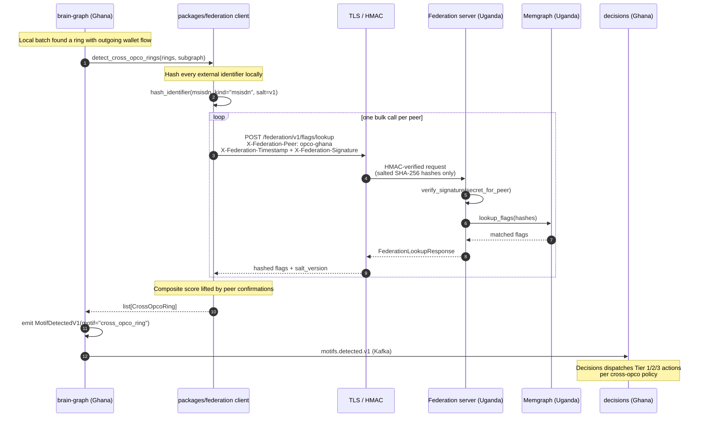

# Federation protocol — sequence

How brain-graph + api-enterprise talk to a peer opco's federation
endpoint to detect cross-opco rings without leaking PII.

**What to look for.**

1. **Hash before send.** Step 3 happens in this opco's process. The
   wire never carries plaintext — the network layer (step 4) only ever
   sees the hex digest. This is the architectural enforcement of
   CLAUDE.md §7.5.
2. **HMAC + freshness window.** Step 5 verifies the signature against
   the peer-pair shared secret (Phase 4) or the SPIFFE workload identity
   (Phase 4.5). Stale or unsigned requests are dropped before the
   adapter is called.
3. **Hashed-only response.** Step 7 never decodes a hash back to
   plaintext — the peer Memgraph adapter hashes inside the Cypher
   RETURN clause so plaintext does not leak even via a server-side bug.
4. **Decisions sees a normal motif.** The downstream pipeline does not
   need to know that this motif came from federation — `decisions`
   already handles the full motif catalogue. Cross-opco prioritisation
   is via the policy YAML (`services/decisions/policies/`).

## Failure semantics

| Failure | Effect |
| --- | --- |
| Network timeout | Single peer skipped (logged, metric incremented); other peers still queried |
| HMAC verification fails | 401 to the peer; `federation_server_requests_total{outcome=auth_invalid}` |
| Stale timestamp | 401; replay window is 5 min |
| Salt rotation in flight | Both `v1` and `v2` accepted for 7 days |
| Unknown peer | 401 with `outcome=auth_no_peer`; never returns "yes I have data on X" |
